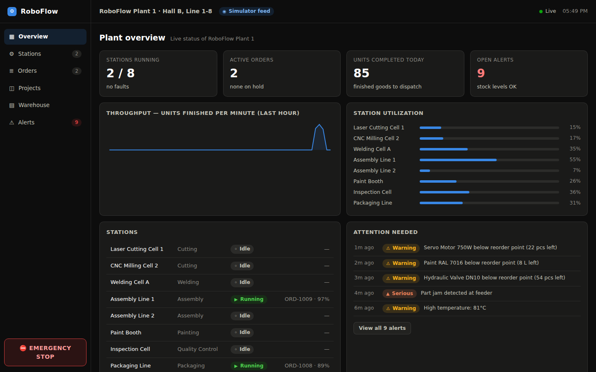

# RoboFlow

An online control room for automated industrial production. It gives a factory
manager one live screen for everything on the floor: projects, workstations and
robots, workflow status, order whereabouts, warehouse stock, alerts — plus
basic operator commands (start / pause / stop a station, emergency stop,
acknowledge alerts, create orders, change priorities).

It is also a factory *design* tool:

- **Design studio → Station types** — design your own stations: icon, time per
  unit, materials consumed (inputs) and produced (outputs), and a **footprint**
  (width × depth in floor cells, up to 4×4) so the layout view reflects real
  floor space. Stations can be **composite** (recursive): one physical cell
  that contains other stations — including other composites — and can do all
  of their jobs.
- **Half products (WIP)** — inputs and outputs are real inventory items, and a
  station's output is usually a *half product* (e.g. the Cutter turns steel
  sheets into Cut Parts; the Welder consumes Cut Parts). Materials are issued
  from stock when a stage *starts* and the stage's outputs land back in stock
  when it *finishes*, so one step's output literally feeds the next — or any
  other order/line that needs the same half product. Because the binding lives
  on the **workflow step**, the same station type can appear several times in
  one workflow with different materials each time (bend → paint the sheet →
  assemble → paint the whole unit again), and the same Paint Booth serves
  different products with different inputs per line. Workflow material totals
  are netted sequentially, so they show only the *external* purchasing need.
  New half products are defined inline in the station designer. Half products
  a stage produces for its own order's later steps are **reserved** for that
  order, so other orders can't snatch them from the buffer.
- **Station ↔ workflow binding** — by default every station serves every line;
  in the Factory panel a station can be dedicated to one or more workflows
  (multi-select — a composite Finishing Cell can serve several lines at once).
  A station bound to a nested workflow also serves the lines that contain it.
  Placement supports **rotation** (2×1 ↔ 1×2). Orders can be **cancelled** at
  any point, or **rerouted** to the project's current design while waiting.
- **Warehouse management** — category tabs (incl. a WIP tab), stock
  adjustments / goods-in for any user, item settings + catalog editing for
  managers, reserved quantities shown per item.
- **Users** — Settings page: change your password; managers add/remove
  operator and manager accounts.
- **Design studio → Workflows** — chain stations into workflows, reorder steps,
  override the materials any step uses. A workflow step can be a station *or a
  whole other workflow* (recursive nesting, cycle-guarded). Each product line
  (project) picks the workflow its orders run through; edits apply to new
  orders while orders already on the floor keep their routing.
- **Factory** — a Factorio-style top-down floor. Place stations from the
  palette onto the grid (each occupies its designed footprint; a hover ghost
  shows green/red validity before you click, and overlaps or out-of-bounds
  installs are refused) and they instantly become real, live stations that the
  plant dispatches work to. Select a workflow to see its animated conveyor
  route from Warehouse to Dispatch, watch order pucks travel between stations,
  and move / rename / dismantle stations in place. The floor itself is
  resizable (8×6 up to 60×40 cells) and refuses to shrink over installed
  stations.
- **Planned vs. actual pace** — every finished batch records the station's
  real time-per-unit (rolling average per station, per step type). Stations
  show `planned → measured`, workflows and projects show designed vs. measured
  totals, and a station that runs ≥30% slower than designed for 3+ batches
  raises a drift warning — often the first sign of tool wear or a feeding
  problem. One click in the Design studio ("adopt measured time") updates a
  design to the fleet-measured reality. Designed times never *drive* real
  stations: production always advances on the machine's own
  `stage.completed` report.

**Kullanım kılavuzu (Türkçe):** yeni başlayanlar için ayrıntılı el kitabı —
[`docs/KULLANIM_KILAVUZU.md`](docs/KULLANIM_KILAVUZU.md)



## How it works

```
robots / PLC gateways ──POST /api/ingest──▶  server  ──WebSocket /ws──▶  control room UI
                                             │
                              workflow engine + in-memory state
                              (orders, stations, stock, alerts)
```

- **`server/`** — Node/Express. Exposes the telemetry ingestion API, the
  operator command API, and a WebSocket feed that streams the full plant state
  to every connected browser once a second (events and alerts immediately).
  State is kept in memory and snapshotted to `server/data/state.json`; swap in
  a database for a real deployment.
- **`client/`** — React + Vite. Dark control-room UI with six views:
  Overview, Stations, Orders, Projects, Warehouse, Alerts.
- **Built-in simulator** — stands in for the real plant. It pushes the *same*
  messages a robot gateway would send to `/api/ingest`, so the entire pipeline
  is exercised exactly as in production. Disable it with `SIMULATOR=off` when
  connecting real equipment.

## Running it

```bash
npm install

# development (server on :4000, client with hot reload on :5173)
npm run dev

# production (single server on :4000 serving the built UI)
npm run build
npm start
```

Then open http://localhost:5173 (dev) or http://localhost:4000 (production).

Environment variables: `PORT` (default 4000), `SIMULATOR=off` to disable the
floor simulator, `FRESH_STATE=1` to ignore the saved snapshot and reseed.

## Signing in (roles)

Authentication is on by default. First run creates two users in
`server/data/users.json` (change passwords via `POST /api/auth/password`):

| user | password | can do |
|---|---|---|
| `manager` | `manager123` | everything: design stations/workflows, edit the floor, run the plant |
| `operator` | `operator123` | run the plant: station commands, e-stop, orders, alert acks — designs are view-only |

Set `AUTH=off` to disable the login layer entirely (every visitor acts as a
manager — for local development only). Sessions are httpOnly cookies; the
WebSocket feed requires the same session.

## Connecting real robots / stations

Point your robot controllers or PLC gateway at `POST /api/ingest` with JSON
(single message or an array):

```jsonc
{ "kind": "robot.telemetry",  "robotId": "rb_03", "status": "working", "temperatureC": 61.2, "toolWearPct": 44, "cyclesDelta": 2 }
{ "kind": "station.status",   "stationId": "st_weld1", "status": "fault", "reason": "Torque limit exceeded on axis 3" }
{ "kind": "station.progress", "stationId": "st_weld1", "progress": 62 }
{ "kind": "stage.completed",  "stationId": "st_weld1" }
{ "kind": "alert",            "source": "line-plc", "severity": "warning", "message": "Air pressure low" }
```

The workflow engine reacts server-side: `stage.completed` advances the active
order to its next stage, dispatches queued orders to idle stations, and books
material consumption against the warehouse.

Machine-facing endpoints (`/api/ingest`, `/api/commands*`) don't use the login
session — they're open by default; set `INGEST_TOKEN` to require an
`x-api-key` header from gateways.

### Commands OUT to real equipment

Every operator command (start/pause/stop/reset_fault, plus plant-wide
`emergency_stop`) is recorded in a command queue so real equipment can receive
and execute it. Two transports, use either:

- **Polling** — the gateway fetches and acknowledges:
  `GET /api/commands?status=pending&target=<stationId>` → execute →
  `POST /api/commands/:id/ack`. (With the simulator on, commands are
  executed locally and enter the log pre-acked.)
- **MQTT** — set `MQTT_URL` (plus optional `MQTT_USERNAME`/`MQTT_PASSWORD`)
  and the server connects to your broker: each command is published to
  `roboflow/commands/<stationId>` (or `roboflow/commands/all`) as it happens,
  and telemetry published by gateways to `roboflow/telemetry` (same JSON as
  `/api/ingest`) flows straight into the plant state. HTTP and MQTT work
  side by side.

## Command API (what the UI buttons call)

| Endpoint | Action |
|---|---|
| `POST /api/stations/:id/command` | `{"action": "start" \| "pause" \| "stop" \| "reset_fault"}` |
| `POST /api/emergency-stop` | halt every station |
| `POST /api/alerts/:id/ack` | acknowledge an alert |
| `POST /api/orders` | `{projectId, customer, qty, priority?, dueInDays?}` |
| `POST /api/orders/:id/priority` | `{"priority": "low" \| "normal" \| "high"}` |
| `GET /api/state` | full plant snapshot (same payload as the WebSocket feed) |

## Designer API (what the Design studio and Factory pages call)

| Endpoint | Action |
|---|---|
| `POST/PUT/DELETE /api/station-types[/:id]` | design station types; `{name, icon, timeSecPerUnit, inputs, outputs, composite, children}` |
| `POST/PUT/DELETE /api/workflows[/:id]` | design workflows; steps are `{kind: "station" \| "workflow", refId, inputs?}` |
| `POST /api/stations` | install a station on the floor: `{typeId, x, y, name?}` |
| `PATCH /api/stations/:id` | move / rename: `{x?, y?, name?}` |
| `DELETE /api/stations/:id` | dismantle (refused while it works on an order) |
| `POST /api/projects` | new product line: `{name, product, workflowId}` |
| `PATCH /api/projects/:id` | reassign workflow: `{workflowId}` (new orders only) |

Recursion is cycle-guarded server-side: a workflow can never contain itself
(directly or through nesting) and a composite station can never contain itself.
Orders snapshot their flattened workflow at creation, so editing definitions
never disturbs work already in progress.
